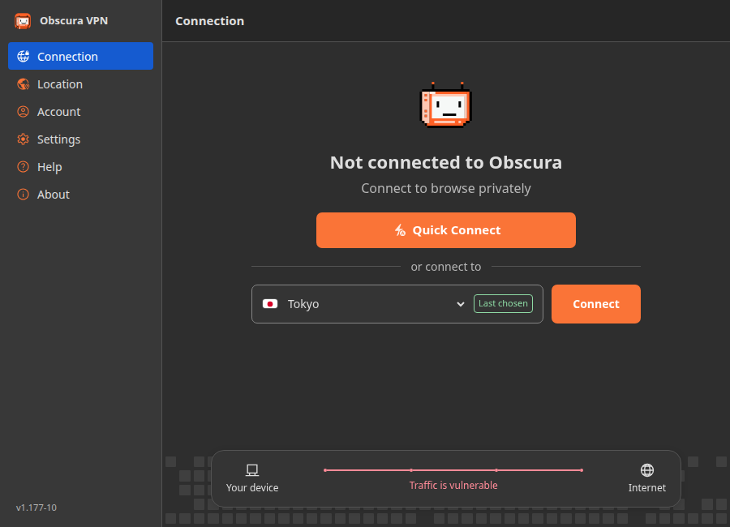

# Obscura Simple

A Linux desktop client for Obscura VPN with a lightweight HTML/CSS/JavaScript interface, a GTK/WebKit shell, and the existing Rust VPN backend.

This is an independent fork of [Sovereign-Engineering/obscuravpn-client](https://github.com/Sovereign-Engineering/obscuravpn-client), based on upstream `v1.177` with its commit history preserved. It is not the official Obscura client. This fork's UI, documentation, and release notes are maintained in English.

## Current release

**[Obscura Simple UI 1.177-11](https://github.com/gnustella-lab/obscura-simple/releases/tag/v1.177-simple-11)** is the current published release.

| Item | Current state |
| --- | --- |
| Release tag | `v1.177-simple-11` |
| Debian package | `obscura-simple_1.177-11_amd64.deb` |
| Package and executable version | `1.177-11` |
| Published architecture | `amd64` |
| Package target | Ubuntu 24.04 or a system with compatible dependencies |
| Download size | About 24 MB |

- [Download the `.deb`](https://github.com/gnustella-lab/obscura-simple/releases/download/v1.177-simple-11/obscura-simple_1.177-11_amd64.deb)
- [Download `SHA256SUMS`](https://github.com/gnustella-lab/obscura-simple/releases/download/v1.177-simple-11/SHA256SUMS)
- [Release notes](release-notes/v1.177-simple-11.md) · [All releases](https://github.com/gnustella-lab/obscura-simple/releases)

Release binaries are attached to GitHub releases, not committed to the repository. `tag.json` tracks the upstream version (`1.177`); the Debian `-N` revision and `v1.177-simple-N` tag identify this fork's releases.

## Install or upgrade

Download the `.deb` and `SHA256SUMS` into the same directory, then run:

```bash
sha256sum -c SHA256SUMS && sudo apt install ./obscura-simple_1.177-11_amd64.deb
sudo obscura add-operator "$USER"
systemctl status obscura.service --no-pager
```

The package installs the CLI, GUI, systemd service, desktop entry, icons, and permission setup. It enables and starts the service on installation and restarts an active service during an upgrade.

Open **Obscura VPN** from your application launcher, or run:

```bash
obscura-gui
```

Close and reopen an already-running GUI after upgrading so its version matches the service. If permission changes have not reached your desktop session, sign out and back in. `newgrp obscura` refreshes group membership for a terminal shell.

An Obscura account is required to connect. You can sign in through the GUI or use the CLI:

```bash
obscura login
obscura status
obscura connect
obscura disconnect
```

`obscura login` prompts for the account number. With the kill switch enabled, disconnecting the VPN intentionally leaves internet traffic blocked; disable the kill switch in Settings when you want to allow traffic outside the VPN.

## Interface



*Preview using sample data. [All screenshots](previews/official-ui/) and an [HTML gallery for local viewing](previews/official-ui/index.html) are included in the repository.*

The current UI follows the official app's visual style while retaining this fork's Linux functionality:

- **Connection:** Quick Connect, expandable country and city selection, session information, and a protection status panel. Background pixels fill orange from bottom to top when connecting, with cancellation and reduced-motion support.
- **Location:** searchable locations grouped by region with expandable country sublists, last-chosen and pinned locations, keyboard activation, and local SVG country flags with their restored proportions and rounded borders.
- **Account:** subscription status, masked/revealed account number, copying, payment and WireGuard configuration links, logout, and account deletion.
- **Settings:** launch at login, auto-connect, kill switch, local network access, key rotation, DNS blocking, and appearance controls.
- **Help:** diagnostic archive creation, an optional problem description, support contact, and social links.
- **About:** official artwork and wordmark, the running version, source/license links, and a link to the latest GitHub release. The update button opens the release page; it is not an automatic updater.
- **Developer:** available by clicking the version five times in About; the native sidebar also supports `Ctrl+Shift+D`.

The GTK sidebar and backend navigation state stay synchronized. A matching web sidebar is used for browser previews and hidden inside the native app, avoiding duplicate navigation. Light and dark themes share the same orange accent; dark-mode primary buttons use white text and a white Quick Connect icon. Narrow layouts are supported.

Connection background animation can follow the system preference, animate bottom to top, or remain static. Choose **Settings → Appearance → Connection background animation → Animate bottom to top** to enable the effect only in this app when desktop animations are disabled. The default follows the system preference.

The `1.177-11` checks cover country expansion, search, selection, keyboard focus, full picker outlines, narrow layouts, animation progression, cancellation, and saved motion preferences. See the [updated previews](previews/location-improvements/index.html).

## Kill switch status

The kill switch is a regular setting; its experimental label was removed in `1.177-9`. The backend is unchanged in `1.177-11`.

When enabled, the packaged system service reads the saved preference and installs blocking rules **before network preparation at boot**. It announces readiness only after the kernel acknowledges those rules. Invalid or unreadable preferences retain protection while initialization retries. DNS setup failures cannot bypass firewall installation, and the systemd descriptor store preserves the firewall socket across service crashes and restarts.

The UI distinguishes a VPN connection, internet blocked by the kill switch, and protection that has not been confirmed. A saved preference is not displayed as proof that firewall installation succeeded.

### Validation scope

The kill switch changes passed 18 Rust unit tests and 3 isolated nftables/TUN tests. Package-level lifecycle validation used an Ubuntu 24.04 KVM guest, kernel `6.8.0-138-generic`, systemd `255.4-1ubuntu8.17`, and a real VPN connection.

Two corrected protected boots captured **zero unmarked DNS, UDP, or TCP packets outside the tunnel**. The disabled-kill-switch control allowed traffic as expected. Tunnel loss/reconnection, network switching, deep suspend/resume, service crash/restart, and invalid-configuration recovery also passed without observed leaks.

These results describe the tested environment, not every distribution, physical Wi-Fi driver, suspend implementation, or network configured in an initramfs before normal systemd startup. Boot ordering depends on the packaged unit; manually launching a service after the network is already active does not provide the same startup ordering.

- [Boot correction and validation report](KILL_SWITCH_BOOT_FIX_REPORT.md)
- [Test commands and coverage](KILL_SWITCH_TESTING.md)
- [Historical pre-fix failure report](KILL_SWITCH_LIFECYCLE_REPORT.md)

The `1.177-10` UI was additionally checked across all six screens, light/dark themes and narrow layouts, including navigation, search, pinning, account-number masking, protection states, keyboard controls, and pixel animation behavior. Both release executable versions, the embedded UI, installation scripts, and the downloaded GitHub artifact were verified.

## Build from source

Run the following commands from the repository root. Native builds require Rust/Cargo, Python 3.12+, a C build toolchain, `pkg-config`, GLib resource tools, and development libraries for GTK 4, libadwaita, WebKitGTK 6, libsoup 3, and TPM2/TSS. Creating the package also requires `dpkg-deb`. The installed package's runtime dependencies are declared in [the build script](contrib/bin/build-simple-deb.bash).

### Build the `.deb`

```bash
CARGO_BUILD_JOBS=1 ./contrib/bin/build-simple-deb.bash
# Output: ./obscura-simple_1.177-11_amd64.deb on an amd64 host
```

This generates the Simple UI resources, builds both release binaries with matching versions, and stages the package and service installation scripts. Nix and Docker are not required for this path. One build job is useful on machines with limited RAM.

### Develop the GUI

```bash
./simple-ui/rebuild.sh
./rustlib/target/debug/obscura-gui
```

The helper generates resources and builds the debug GUI. It expects the service to be running. Keep the GUI and service version strings identical; the helper accepts an `OBSCURA_VERSION` override for development.

To build a matching debug CLI/service binary:

```bash
OBSCURA_VERSION=v1.177-11 cargo build \
  --manifest-path rustlib/Cargo.toml --locked --bin obscura
```

For the detailed UI structure and additional development commands, see [SIMPLE_UI.md](SIMPLE_UI.md). The native wrappers in the repository are development helpers, not the recommended installation path.

## Run checks

```bash
node --check simple-ui/app.js
node --test simple-ui/official-ui.test.cjs \
  simple-ui/pixel-animation.test.cjs simple-ui/kill-switch.test.cjs

cargo test --manifest-path rustlib/Cargo.toml --locked --lib --bin obscura

# With the package installed:
systemd-analyze verify linux/common/obscura.service

# Kernel integration checks in isolated namespaces:
bash contrib/bin/linux-kill-switch-test.bash
```

Node is used for development checks, not required to run the installed app. The kernel runner requires namespace/netlink access and `/dev/net/tun`; it uses Cargo's offline mode, so Rust dependencies must already be available. Kernel tests are intentionally ignored by ordinary `cargo test` and run explicitly by the isolated runner. See [KILL_SWITCH_TESTING.md](KILL_SWITCH_TESTING.md) for systemd and VM validation details.

## Troubleshooting

For service startup or connection problems:

```bash
obscura status --json
systemctl status obscura.service --no-pager
journalctl -u obscura.service -n 100 --no-pager
```

A service that remains `activating` may be retrying configuration or firewall setup. Check its logs rather than assuming it is crash-looping. A version mismatch usually means the GUI needs reopening after an upgrade or development binaries were built with a different `OBSCURA_VERSION`.

For fork-specific bugs, use [this repository's issue tracker](https://github.com/gnustella-lab/obscura-simple/issues). For the Obscura VPN service, account, or billing, contact [support@obscura.net](mailto:support@obscura.net). Do not include account numbers or credentials in public reports.

## Repository scope

| Path | Purpose |
| --- | --- |
| `simple-ui/` | Vanilla frontend, local artwork/flags, and UI tests |
| `rustlib/src/gui/` | Native GTK/WebKit shell and command bridge |
| `rustlib/src/bin/obscura/service/` | System service and Linux network integration |
| `linux/common/` | Shared service unit, desktop integration, and icons |
| `contrib/bin/build-simple-deb.bash` | This fork's single-package Debian build |
| `previews/official-ui/` | Screenshots and local preview gallery |
| `obscura-ui/` | Retained upstream React/Mantine interface and assets |
| `docs/` | Upstream conventions, terminology, and architecture |

Upstream-derived Nix/container workflows, split Debian/RPM/Arch packaging, and signing utilities remain in `contrib/` and `linux/`. Their presence does not imply that this fork publishes signed distribution repositories or has validated every upstream platform. The current published artifact is the amd64 `.deb` linked above. Use this fork's GitHub release assets rather than the upstream repository deployment instructions.

## License

See [LICENSE.md](LICENSE.md) for the PolyForm Noncommercial License 1.0.0. Upstream code and artwork retain their respective notices.
